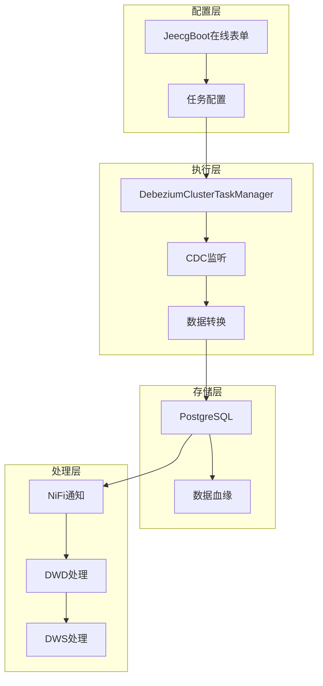

# JeecgBoot DataIngest 数据接入模块

<div align="center">


**基于 JeecgBoot 在线表单设计的企业级 CDC 数据接入解决方案**

[功能特性](#-功能特性) •
[快速开始](#-快速开始) •
[文档](#-文档) •
[架构设计](#-架构设计) •
[贡献指南](#-贡献指南)

</div>

## 🎯 项目简介

DataIngest 是一个基于 JeecgBoot 平台开发的企业级数据接入模块，专门用于实现 CDC（Change Data Capture）实时数据同步。该模块完全基于 JeecgBoot 生态，无需复杂的中间件配置，直接支持 **Debezium + PostgreSQL + NiFi** 的完整数据处理链路。

### 🏗️ 核心架构

```
用户配置任务 → Debezium监听CDC → 数据保存PostgreSQL → 通知NiFi处理
```

## ✨ 功能特性

### 🎨 基于 JeecgBoot 在线表单
- ✅ **可视化配置**：通过在线表单快速配置数据接入任务
- ✅ **主子表设计**：支持复杂的一对多关系配置
- ✅ **权限控制**：完整的RBAC权限管理
- ✅ **Excel导入导出**：批量配置和数据导出
- ✅ **代码生成**：标准的CRUD功能自动生成

### 🔄 CDC 数据同步
- ✅ **多数据源支持**：MySQL、PostgreSQL、SQL Server
- ✅ **实时监听**：基于 Debezium 的变更数据捕获
- ✅ **集群部署**：支持多节点负载均衡和故障转移
- ✅ **智能表名**：两级优先级的表名生成策略
- ✅ **字段映射**：灵活的字段转换和脱敏规则

### 📊 数据血缘追踪
- ✅ **完整血缘**：自动记录数据来源和转换路径
- ✅ **质量评分**：数据质量自动评估和监控
- ✅ **软删除**：保留历史变更记录
- ✅ **业务域**：按业务领域分类管理

### 🚀 NiFi 深度集成
- ✅ **DWD/DWS处理**：支持数据仓库分层处理
- ✅ **多种通知模式**：立即/批量/定时通知
- ✅ **处理器控制**：自动触发和状态监控
- ✅ **延迟优化**：可配置的延迟通知机制

### 🔒 企业级特性
- ✅ **分布式锁**：基于Redis的任务协调
- ✅ **监控告警**：完整的执行日志和统计
- ✅ **安全认证**：数据传输和存储加密
- ✅ **性能优化**：批量处理和连接池管理

## 🚀 快速开始

### 环境要求
- JDK 1.8+
- Maven 3.6+
- Redis 5.0+
- PostgreSQL 13+
- JeecgBoot 3.7.0+

### 安装部署

#### 1. 克隆项目
```bash
git clone https://github.com/your-org/jeecgboot-dataingest.git
cd jeecgboot-dataingest
```

#### 2. 数据库初始化
```sql
-- 执行数据库脚本
\i docs/data_ingest_moudle_ingest_task.sql
\i docs/data_ingest_moudle_data_source_config.sql  
\i docs/data_ingest_moudle_data_cdc_table.sql
\i docs/data_ingest_moudle_field_mapping.sql
\i docs/data_ingest_moudle_ingest_log.sql
```

#### 3. 配置文件
```yaml
# application.yml
spring:
  redis:
    host: localhost
    port: 6379
  datasource:
    url: jdbc:postgresql://localhost:5432/jeecg_boot
    username: postgres
    password: your_password

dataingest:
  cluster:
    enabled: true
    nodeId: ${spring.application.name}-${server.port}
  debezium:
    offsetStoragePath: /tmp/debezium/offsets
    historyStoragePath: /tmp/debezium/history
```

#### 4. 启动服务
```bash
mvn spring-boot:run
```

#### 5. 访问管理界面
```
http://localhost:8080/jeecg-boot/dataingest/task
```

### 快速配置示例

#### 创建MySQL CDC任务
```json
{
  "taskName": "用户中心数据同步",
  "taskType": "MYSQL_CDC", 
  "dataSource": {
    "hostname": "192.168.1.100",
    "port": "3306",
    "database": "user_center",
    "username": "cdc_user",
    "password": "password123"
  },
  "cdcTables": [
    {
      "sourceTable": "user_info",
      "targetTable": "ods_user_info",
      "businessDomain": "user_management"
    }
  ]
}
```

## 📚 文档

### 核心文档
- [📋 模块概览](docs/MODULE_OVERVIEW.md) - 完整的功能介绍和设计理念
- [🏗️ 架构设计](docs/ARCHITECTURE_DESIGN.md) - 详细的技术架构和设计原理  
- [📖 使用指南](docs/USAGE_GUIDE.md) - 完整的配置和操作手册

### 增强功能文档
- [🚀 增强CDC指南](docs/ENHANCED_CDC_GUIDE.md) - 高级CDC配置和优化
- [🔧 自动建表功能](docs/AUTO_TABLE_CREATION.md) - 自动表结构创建和管理
- [📊 ODS示例](docs/CDC_ODS_EXAMPLE.md) - 完整的ODS层实施案例

### 数据库脚本
- [📄 SQL脚本](docs/) - 完整的数据库建表脚本

## 🏗️ 架构设计

### 系统架构图


### 核心组件
- **TaskManager**：任务生命周期管理
- **ClusterManager**：集群协调和负载均衡
- **DataProcessor**：数据转换和质量检查
- **NotificationService**：NiFi集成和通知
- **MonitoringService**：监控和告警

## 🎯 适用场景

### 🏢 企业数据湖建设
- 实时同步业务数据到数据湖ODS层
- 多源数据统一接入和管理
- 完整的数据血缘和质量管控

### 📊 实时数据仓库
- CDC实时同步到数据仓库
- 自动触发DWD/DWS层处理
- 支持Lambda和Kappa架构

### 🔄 微服务数据同步  
- 跨服务的数据实时同步
- 事件驱动的数据更新
- 服务间数据一致性保证

### 🔄 数据迁移备份
- 大规模数据迁移项目
- 实时数据备份和容灾
- 跨环境数据同步

## 📊 性能指标

| 指标 | 数值 | 说明 |
|------|------|------|
| 同步延迟 | < 3秒 | 99%的变更事件在3秒内同步 |
| 吞吐量 | 10万条/分钟 | 单节点处理能力 |
| 可用性 | 99.9% | 集群模式下的可用性 |
| 扩展性 | 线性扩展 | 支持水平扩展 |

## 🤝 贡献指南

我们欢迎所有形式的贡献！

### 如何参与
1. Fork 本项目
2. 创建特性分支 (`git checkout -b feature/AmazingFeature`)
3. 提交更改 (`git commit -m 'Add some AmazingFeature'`)
4. 推送到分支 (`git push origin feature/AmazingFeature`)
5. 开启 Pull Request

### 开发规范
- 遵循阿里巴巴Java开发规约
- 完善的单元测试覆盖
- 详细的代码注释
- 更新相关文档

## 📄 许可证

本项目采用 [Apache 2.0](LICENSE) 许可证 - 查看 LICENSE 文件了解详情

## 🙏 致谢

- [JeecgBoot](https://github.com/jeecgboot/jeecg-boot) - 优秀的低代码平台
- [Debezium](https://debezium.io/) - 强大的CDC解决方案
- [Apache NiFi](https://nifi.apache.org/) - 数据流处理引擎
- [PostgreSQL](https://www.postgresql.org/) - 可靠的数据库系统

## 📞 联系我们

- 📧 邮箱：support@your-company.com
- 💬 微信群：扫码加入技术交流群
- 🐛 问题反馈：[GitHub Issues](https://github.com/your-org/jeecgboot-dataingest/issues)
- 📖 文档网站：https://docs.your-company.com/dataingest

---

<div align="center">

**⭐ 如果这个项目对您有帮助，请给我们一个 Star！⭐**

Made with ❤️ by [Your Team Name]

</div>