# DataIngest 架构设计文档

## 🏗️ 整体架构图

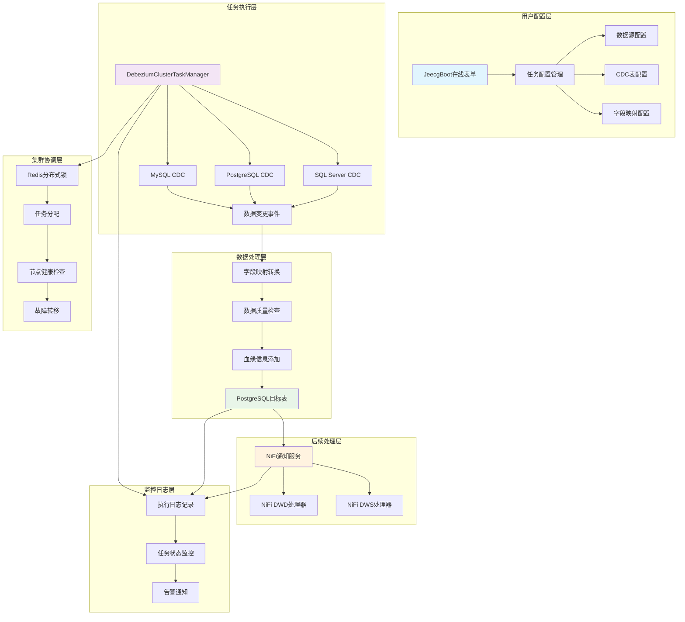

## 📊 数据模型设计

### ER关系图

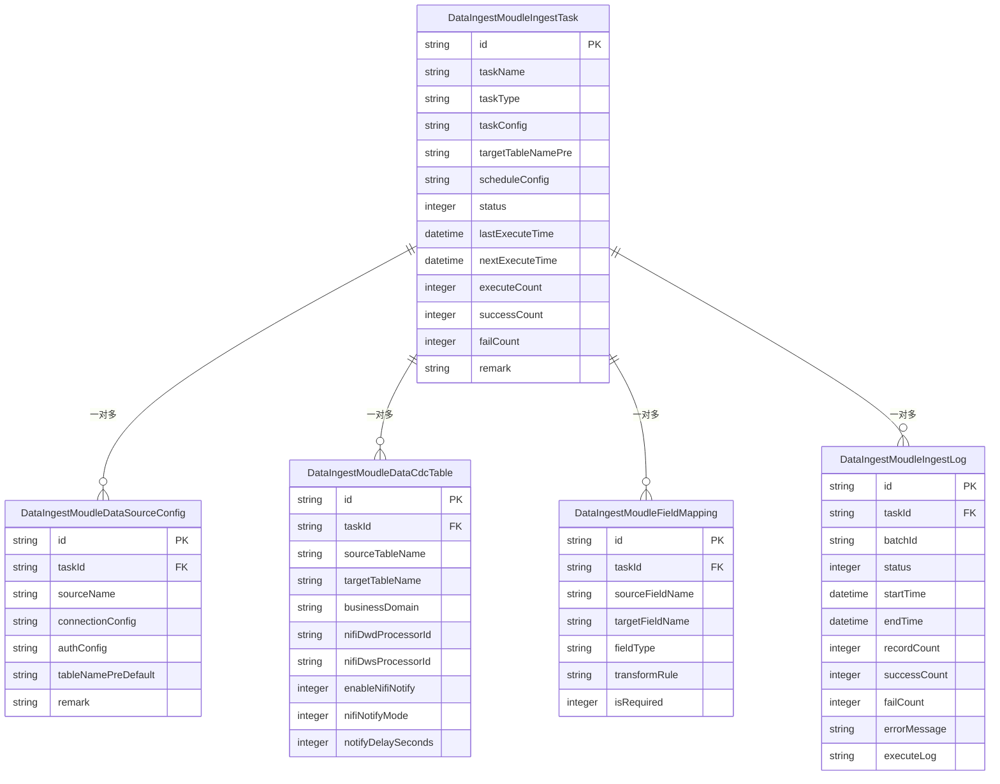

## 🔧 核心组件架构

### 1. Debezium集群任务管理器

```mermaid
graph LR
    subgraph "集群节点管理"
        A[节点注册] --> B[心跳维护]
        B --> C[节点发现]
        C --> D[健康检查]
    end
    
    subgraph "任务调度"
        E[任务分配] --> F[负载均衡]
        F --> G[故障转移]
        G --> H[任务监控]
    end
    
    subgraph "分布式锁"
        I[Redis锁管理] --> J[任务唯一性]
        J --> K[并发控制]
        K --> L[死锁检测]
    end
    
    subgraph "CDC引擎"
        M[Debezium引擎] --> N[变更事件]
        N --> O[数据转换]
        O --> P[目标写入]
    end
    
    D --> E
    H --> I
    L --> M
```

**关键特性**：
- **分布式协调**：基于Redis实现节点间协调
- **任务唯一性**：分布式锁确保同一任务不重复执行
- **故障转移**：自动检测节点故障并重新分配任务
- **负载均衡**：根据节点负载动态分配任务

### 2. NiFi集成架构

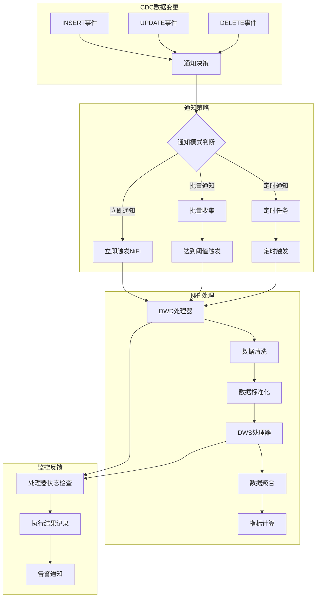

**通知模式说明**：
- **立即通知**（Mode=1）：每个CDC事件立即触发NiFi处理器
- **批量通知**（Mode=2）：收集一定数量的变更后批量触发
- **定时通知**（Mode=3）：按固定时间间隔触发，适合大批量处理

### 3. 数据血缘追踪架构

```mermaid
graph LR
    subgraph "源数据识别"
        A[源数据库] --> B[源表名]
        B --> C[业务域标识]
        C --> D[数据源配置]
    end
    
    subgraph "血缘信息生成"
        D --> E[血缘路径构建]
        E --> F[转换规则记录]
        F --> G[质量评分计算]
        G --> H[时间戳标记]
    end
    
    subgraph "目标表增强"
        H --> I[血缘字段添加]
        I --> J[索引自动创建]
        J --> K[软删除支持]
        K --> L[历史版本管理]
    end
    
    subgraph "血缘查询"
        L --> M[血缘关系查询]
        M --> N[影响分析]
        N --> O[数据质量报告]
    end
```

**血缘字段设计**：
```sql
-- 自动添加到每个ODS表的血缘字段
ALTER TABLE ods_target_table ADD COLUMN IF NOT EXISTS source_database VARCHAR(100);
ALTER TABLE ods_target_table ADD COLUMN IF NOT EXISTS source_table VARCHAR(100);
ALTER TABLE ods_target_table ADD COLUMN IF NOT EXISTS business_domain VARCHAR(50);
ALTER TABLE ods_target_table ADD COLUMN IF NOT EXISTS data_lineage TEXT;
ALTER TABLE ods_target_table ADD COLUMN IF NOT EXISTS transformation_rules TEXT;
ALTER TABLE ods_target_table ADD COLUMN IF NOT EXISTS data_quality_score DECIMAL(3,2);
ALTER TABLE ods_target_table ADD COLUMN IF NOT EXISTS sync_timestamp BIGINT;
ALTER TABLE ods_target_table ADD COLUMN IF NOT EXISTS cdc_operation VARCHAR(10);
ALTER TABLE ods_target_table ADD COLUMN IF NOT EXISTS record_status VARCHAR(10) DEFAULT 'ACTIVE';
```

## 🔄 数据流转设计

### 完整数据流转图

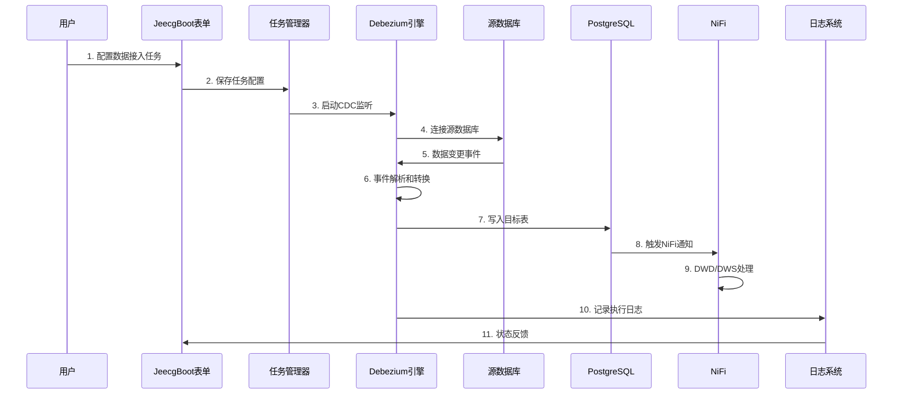

### 错误处理流程

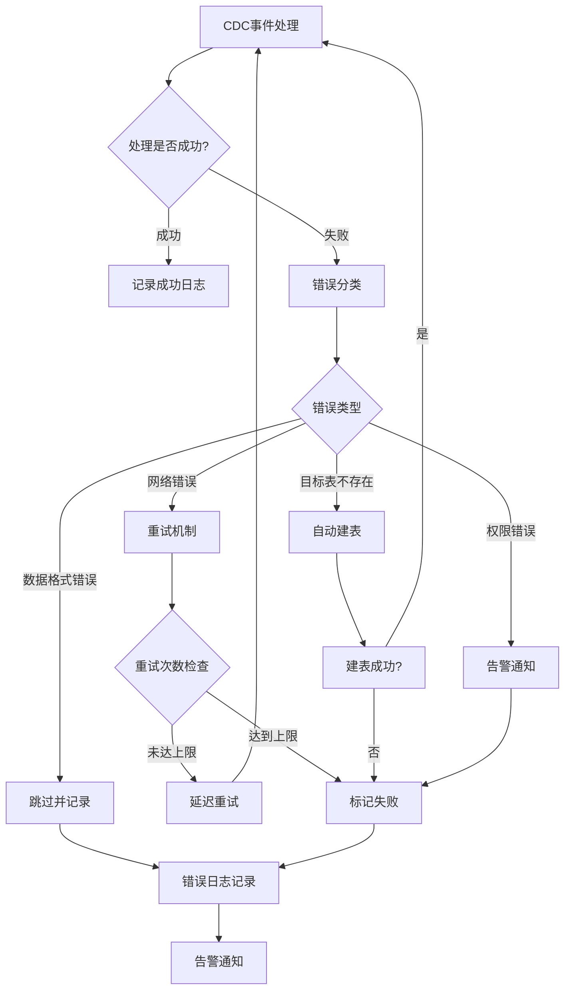

## 🚀 性能优化设计

### 1. 批量处理优化

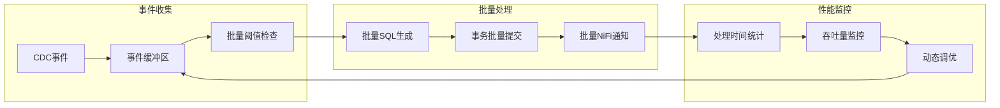

**优化策略**：
- **批量大小**：根据数据量和延迟要求动态调整（默认1000条）
- **提交频率**：平衡数据一致性和性能（默认5秒或1000条）
- **并发控制**：多线程处理不同表的数据变更
- **内存管理**：限制缓冲区大小防止内存溢出

### 2. 集群负载均衡

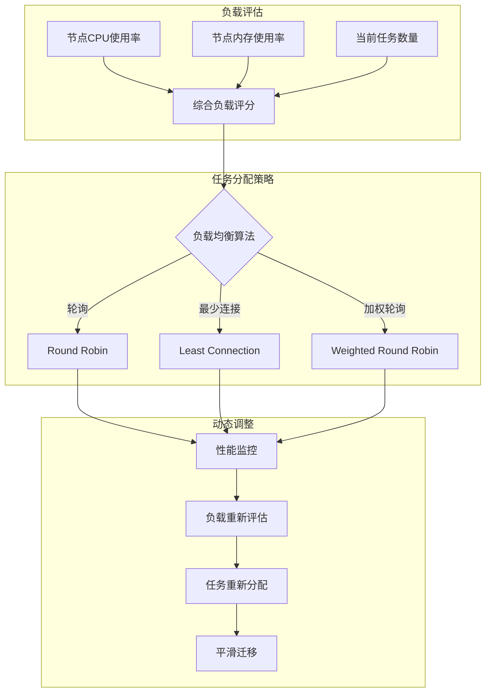

### 3. 缓存策略

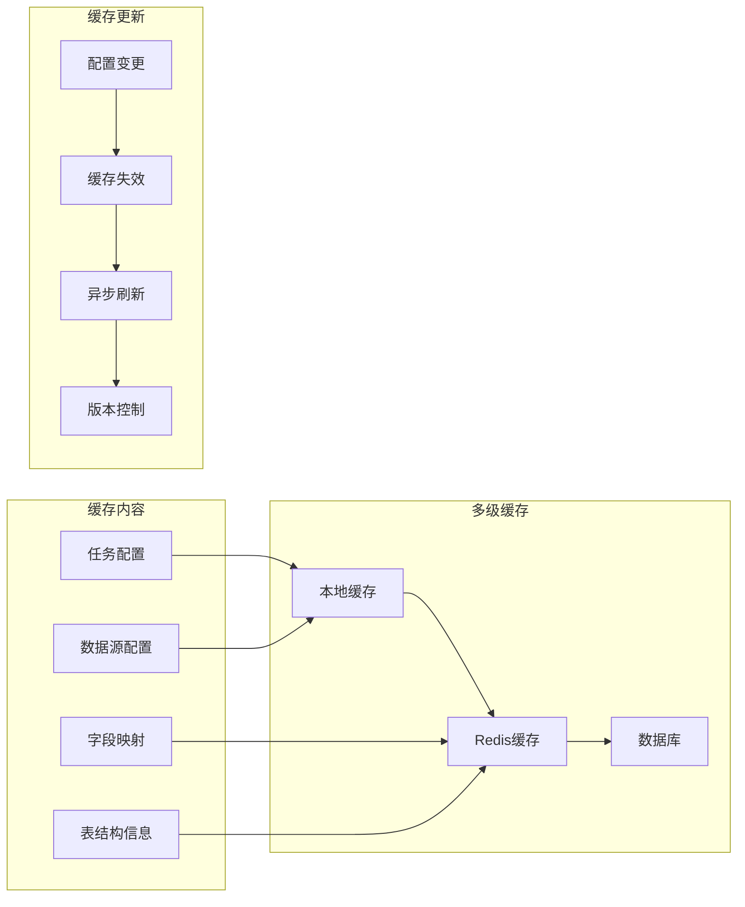

## 🔒 安全架构设计

### 1. 数据安全

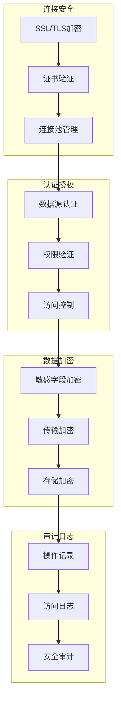

### 2. 系统安全

- **访问控制**：基于JeecgBoot的RBAC权限模型
- **API安全**：JWT令牌验证和API限流
- **数据脱敏**：敏感字段自动脱敏处理
- **审计追踪**：完整的操作日志和变更记录

## 📊 监控告警架构

### 监控指标体系

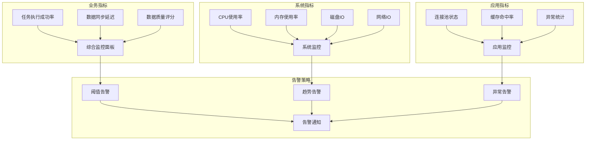

**告警级别**：
- **P0 紧急**：系统不可用、数据丢失
- **P1 重要**：功能异常、性能严重下降
- **P2 一般**：性能轻微下降、配置问题
- **P3 提示**：资源使用提醒、优化建议

## 🔄 扩展性设计

### 水平扩展能力

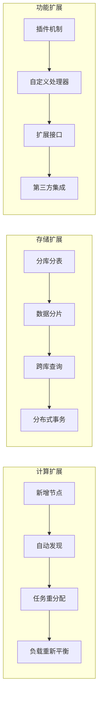

### 插件化架构

- **数据源插件**：支持新的数据库类型
- **转换插件**：自定义数据转换逻辑
- **通知插件**：支持更多的下游系统
- **监控插件**：集成第三方监控系统

## 📈 未来演进规划

### 短期目标（3个月）
- [ ] 支持更多数据源类型（Oracle、MongoDB等）
- [ ] 增强数据质量检查功能
- [ ] 优化大表同步性能
- [ ] 完善监控告警体系

### 中期目标（6个月）
- [ ] 支持流式计算集成（Flink/Spark）
- [ ] 增加数据血缘可视化界面
- [ ] 支持Schema演化自动处理
- [ ] 增强集群管理功能

### 长期目标（1年）
- [ ] AI驱动的数据质量优化
- [ ] 自动化运维和故障自愈
- [ ] 多云部署支持
- [ ] 实时数据湖架构完善

这个架构设计充分考虑了企业级应用的需求，在保证功能完整性的同时，注重性能、安全性和可扩展性，为数据接入提供了一个稳定可靠的技术基础。