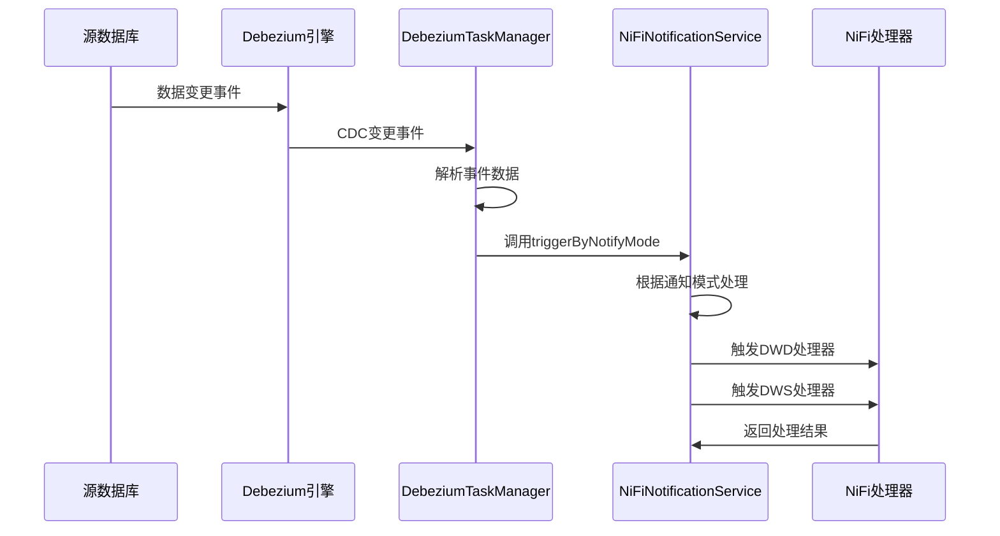

# NiFi 集成使用示例

## 🎯 概述

本文档展示了如何在 DataIngest 模块中使用 NiFi 通知服务，以及如何正确配置和调用相关接口。

## 🔧 配置说明

### 1. 应用配置（application.yml）

```yaml
# NiFi 集成配置
nifi:
  api:
    base-url: http://localhost:8080/nifi-api
    timeout: 5000
    connection-timeout: 3000
    read-timeout: 10000
  notification:
    enabled: true
    async: true
```

### 2. CDC表配置示例

通过 JeecgBoot 在线表单配置 CDC 表时，需要填写以下 NiFi 相关字段：

```json
{
  "sourceTableName": "user_info",
  "targetTableName": "ods_user_info", 
  "businessDomain": "user_management",
  "nifiDwdProcessorId": "dwd-user-processor-001",
  "nifiDwsProcessorId": "dws-user-summary-001", 
  "enableNifiNotify": 1,
  "nifiNotifyMode": 1,
  "notifyDelaySeconds": 0
}
```

## 🚀 自动集成流程

### CDC 数据变更自动触发流程



### 关键代码流程

1. **DebeziumClusterTaskManager.handleChangeEvent()** - 接收 CDC 事件
2. **DebeziumClusterTaskManager.processChangeEvent()** - 解析事件并查找配置
3. **INiFiNotificationService.triggerByNotifyMode()** - 根据通知模式触发
4. **INiFiNotificationService.triggerDwdProcessor()** - 触发 DWD 层处理
5. **INiFiNotificationService.triggerDwsProcessor()** - 触发 DWS 层处理

## 📊 通知模式说明

### 模式1：立即通知（推荐）
```java
// 每个CDC事件立即触发NiFi处理器
cdcConfig.setNifiNotifyMode(1);
cdcConfig.setNotifyDelaySeconds(0);
```

**特点**：
- 实时性最强
- 适合对延迟敏感的场景
- 资源消耗相对较高

### 模式2：批量通知
```java
// 收集一定数量后批量触发
cdcConfig.setNifiNotifyMode(2);
// TODO: 后续版本实现批量逻辑
```

**特点**：
- 减少NiFi调用频率
- 提高处理效率
- 适合大批量数据场景

### 模式3：定时通知
```java
// 按固定时间间隔触发
cdcConfig.setNifiNotifyMode(3);
// TODO: 后续版本实现定时逻辑
```

**特点**：
- 可控的处理节奏
- 适合对实时性要求不高的场景
- 资源使用平稳

## 🛠️ 手动调用示例

### 在 Controller 中使用

```java
@RestController
@RequestMapping("/dataingest/nifi")
@Slf4j
public class NiFiTestController {

    @Autowired
    private INiFiNotificationService nifiNotificationService;
    
    @Autowired
    private IDataIngestMoudleDataCdcTableService cdcTableService;

    /**
     * 手动触发NiFi处理器
     */
    @PostMapping("/trigger/{processorId}")
    public Result<String> triggerProcessor(
            @PathVariable String processorId,
            @RequestBody JSONObject data) {
        
        boolean result = nifiNotificationService.triggerNiFiProcessor(processorId, data);
        
        if (result) {
            return Result.OK("NiFi处理器触发成功");
        } else {
            return Result.error("NiFi处理器触发失败");
        }
    }

    /**
     * 检查NiFi处理器状态
     */
    @GetMapping("/status/{processorId}")
    public Result<String> checkProcessorStatus(@PathVariable String processorId) {
        String status = nifiNotificationService.checkProcessorStatus(processorId);
        return Result.OK(status);
    }

    /**
     * 根据CDC配置触发处理器
     */
    @PostMapping("/trigger-by-config/{cdcTableId}")
    public Result<String> triggerByConfig(
            @PathVariable String cdcTableId,
            @RequestBody JSONObject changeData) {
        
        DataIngestMoudleDataCdcTable cdcConfig = cdcTableService.getById(cdcTableId);
        if (cdcConfig == null) {
            return Result.error("CDC配置不存在");
        }

        boolean result = nifiNotificationService.triggerByNotifyMode(cdcConfig, changeData);
        
        if (result) {
            return Result.OK("基于配置的NiFi触发成功");
        } else {
            return Result.error("基于配置的NiFi触发失败");
        }
    }
}
```

### 在 Service 中使用

```java
@Service
@Slf4j
public class DataProcessService {

    @Autowired
    private INiFiNotificationService nifiNotificationService;

    /**
     * 业务处理完成后触发NiFi
     */
    public void processBusinessData(String businessDomain, JSONObject businessData) {
        try {
            // 执行业务逻辑
            doBusinessProcess(businessData);
            
            // 触发NiFi后续处理
            boolean notifyResult = nifiNotificationService.triggerByBusinessDomain(
                businessDomain, businessData);
            
            if (notifyResult) {
                log.info("业务数据处理完成，NiFi通知已发送: domain={}", businessDomain);
            } else {
                log.warn("业务数据处理完成，但NiFi通知发送失败: domain={}", businessDomain);
            }
            
        } catch (Exception e) {
            log.error("业务数据处理异常: domain={}", businessDomain, e);
        }
    }
    
    private void doBusinessProcess(JSONObject businessData) {
        // 具体业务逻辑实现
    }
}
```

## 🔍 监控和调试

### 1. 日志配置

```yaml
logging:
  level:
    org.jeecg.dataingest.service.impl.NiFiNotificationServiceImpl: DEBUG
    org.jeecg.dataingest.debezium.DebeziumClusterTaskManager: DEBUG
```

### 2. 关键日志示例

```log
# CDC事件接收
2025-01-01 10:00:00.123 DEBUG --- DebeziumClusterTaskManager : 收到CDC事件: taskId=task_001, node=dataingest-8080, event={...}

# CDC事件处理
2025-01-01 10:00:00.125 DEBUG --- DebeziumClusterTaskManager : 处理CDC事件: taskId=task_001, database=user_db, table=user_info, operation=u

# NiFi通知触发
2025-01-01 10:00:00.130 DEBUG --- NiFiNotificationServiceImpl : 同步触发NiFi处理器成功: dwd-user-processor-001

# 处理结果
2025-01-01 10:00:00.135 DEBUG --- DebeziumClusterTaskManager : NiFi通知触发成功: taskId=task_001, table=user_info, operation=u
```

### 3. 错误排查

**常见问题及解决方案**：

| 问题 | 原因 | 解决方案 |
|------|------|----------|
| NiFi连接超时 | 网络问题或NiFi服务不可用 | 检查网络连接和NiFi服务状态 |
| 处理器ID不存在 | 配置的处理器ID错误 | 检查NiFi中的处理器ID配置 |
| 通知未触发 | enableNifiNotify未启用 | 检查CDC表配置中的通知开关 |
| 批量/定时模式不工作 | 功能待实现 | 当前版本仅支持立即通知模式 |

## 🎯 最佳实践

### 1. 配置建议
- **开发环境**：使用立即通知模式，便于调试
- **生产环境**：根据数据量选择合适的通知模式
- **高并发场景**：考虑使用异步通知（async: true）

### 2. 性能优化
- 合理设置超时时间，避免长时间阻塞
- 使用连接池复用HTTP连接
- 监控NiFi处理器性能，及时调整配置

### 3. 错误处理
- 实现重试机制处理临时网络问题
- 记录详细日志便于问题排查
- 设置告警机制及时发现问题

### 4. 安全考虑
- 配置NiFi API的安全认证
- 使用HTTPS加密API调用
- 限制网络访问权限

通过以上配置和使用方式，您可以充分利用 DataIngest 模块的 NiFi 集成功能，实现完整的 CDC 数据处理流程。